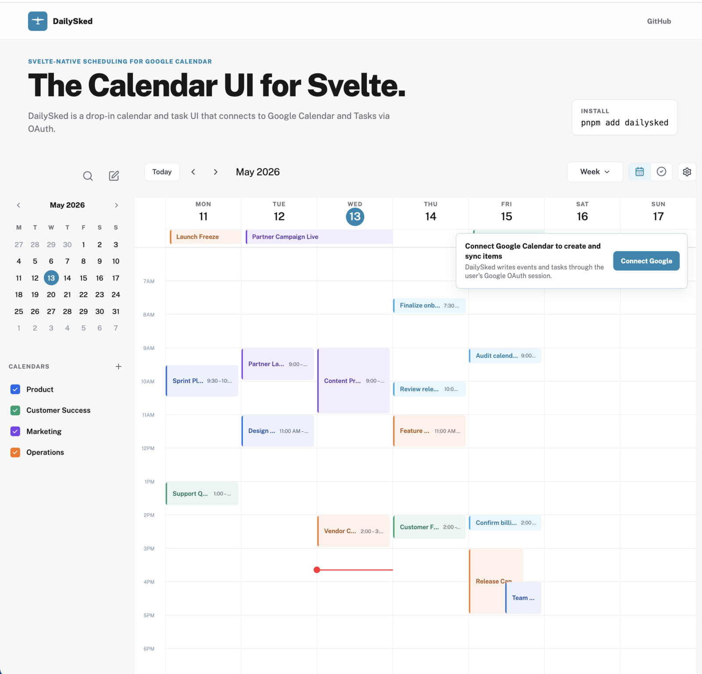

<div align="center">
  

  <h1>DailySked</h1>

  <p>
    <strong>Svelte-first scheduling UI with Google Calendar and Tasks sync.</strong>
  </p>

  <p>
    A ready calendar and task workspace with sidebar navigation, calendar views,
    task mode, event editing, command palette, dashboard widget, and Google OAuth sync helpers.
  </p>

  <p>
    <a href="https://ryanrlindsay.github.io/dailysked/">Demo</a>
    ·
    <a href="https://www.npmjs.com/package/dailysked">Package</a>
    ·
    <a href="LICENSE"></a>
    
    
  </p>
</div>

<p align="center">
  <a href="docs/assets/dailysked-demo.png">
    
  </a>
</p>

## Why DailySked?

- **Product-ready UI**: calendar shell, mini calendar, sidebar filters, week/month/year views, task workspace, and compact widget.
- **Google-first integration**: SvelteKit handlers and typed client helpers for Google Calendar and Google Tasks.
- **Built for product teams**: designed for apps that need a scheduling surface, not a pile of low-level calendar primitives.
- **Contributor-friendly core**: MIT licensed, typed, tested, and built as a reusable Svelte package.

## Status

DailySked is in alpha stage. Be aware that using `latest` tags may cause breaking changes, but we appreciate anyone willing to use latest over versioned tags so that we can receive feedback sooner.

## Install

```bash
pnpm add dailysked
```

Import the component and stylesheet:

```svelte
<script>
  import { DailySkedCalendar } from 'dailysked';
  import 'dailysked/styles.css';
</script>
```

## Quick Start

```svelte
<script>
  import { DailySkedCalendar } from 'dailysked';
  import 'dailysked/styles.css';

  const calendars = [{ id: 'primary', name: 'Calendar', color: '#2286b0' }];
  const events = [];
  const taskLists = [{ id: 'tasks', name: 'Tasks' }];
  const tasks = [];
</script>

<DailySkedCalendar
  {calendars}
  {events}
  {taskLists}
  {tasks}
/>
```

DailySked can also render connected Google Calendar and Google Tasks data when your app provides OAuth routes, token storage, and a sync endpoint.

## Google Sync

DailySked does not create a Google Cloud OAuth client or render the connection settings flow inside the reusable calendar. Your app owns the Google connection screen; DailySked consumes connected state, schedule data, and sync endpoints.

- [SvelteKit Google integration guide](docs/sveltekit-google.md)
- [Google OAuth admin UI handoff](docs/google-oauth-admin-ui-handoff.md)

## Widget

DailySked also exports a compact dashboard widget based on the same Google data model.

```svelte
<script>
  import { DailySkedWidget } from 'dailysked';
  import 'dailysked/styles.css';
</script>

<DailySkedWidget
  calendars={data.calendars}
  events={data.events}
  tasks={data.tasks}
  range="week"
  scheduleHref="/schedule"
  google={{
    connected: Boolean(data.googleAccount),
    syncEndpoint: '/api/google'
  }}
/>
```

## Local Development

```bash
pnpm install
pnpm dev
```

Useful checks:

```bash
pnpm check
pnpm test
pnpm build
pnpm pack --dry-run
```

The local demo uses neutral sample events and tasks when no Google account is connected.

## License

MIT. See [LICENSE](LICENSE).
